<!-- GitHub Profile README -->

---

## About me

Backend-focused Full-Stack Software Engineer, working across the whole cycle from architecture design to production deploys.  
I build APIs and distributed systems with TypeScript (Node.js/Deno) and Go, and integrate LLMs and data pipelines into production workflows.

- Currently building **NoteCast Editor**, a native macOS Markdown editor (Swift/AppKit) from architecture to launch
- B.Sc. in Computer Science at **UFCG** (2021 – 2027)
- Open to backend / fullstack roles

---

## Tech stack

<b>Languages</b> 

<b>Backend</b> 

<b>Frontend</b> 

<b>Data & Messaging</b> 

<b>Infra & Testing</b> 

---

<table align="center">
  <tr><th></th><th>A</th><th>B</th><th>C</th><th>D</th><th>E</th><th>F</th><th>G</th><th>H</th></tr>
  <tr><th>8</th><td></td><td></td><td></td><td></td><td></td><td></td><td></td><td></td></tr>
  <tr><th>7</th><td></td><td></td><td></td><td></td><td></td><td></td><td></td><td></td></tr>
  <tr><th>6</th><td></td><td></td><td></td><td></td><td></td><td></td><td></td><td></td></tr>
  <tr><th>5</th><td></td><td></td><td></td><td></td><td></td><td></td><td></td><td></td></tr>
  <tr><th>4</th><td></td><td></td><td></td><td></td><td></td><td></td><td></td><td></td></tr>
  <tr><th>3</th><td></td><td></td><td></td><td></td><td></td><td></td><td></td><td></td></tr>
  <tr><th>2</th><td></td><td></td><td></td><td></td><td></td><td></td><td></td><td></td></tr>
  <tr><th>1</th><td></td><td></td><td></td><td></td><td></td><td></td><td></td><td></td></tr>
</table>

Paul Morphy vs. Duke of Brunswick &amp; Count Isouard — <i>The Opera Game</i>, Paris 1858. Final position: 17.Rd8#

---

## Contact

  
  
  
  

